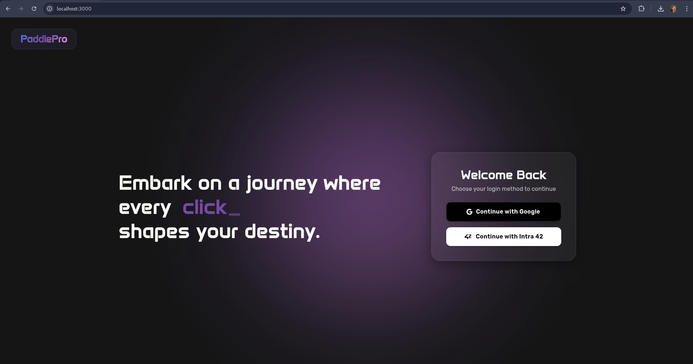
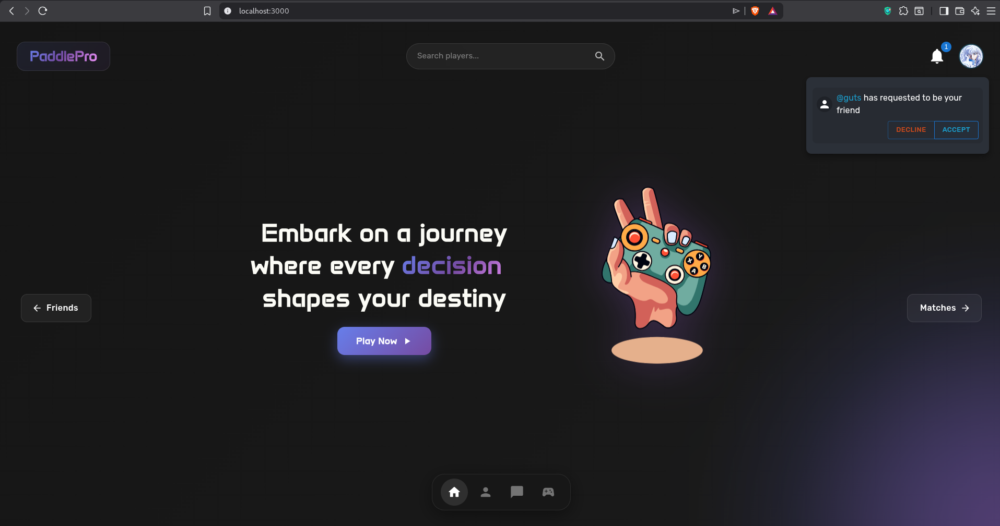
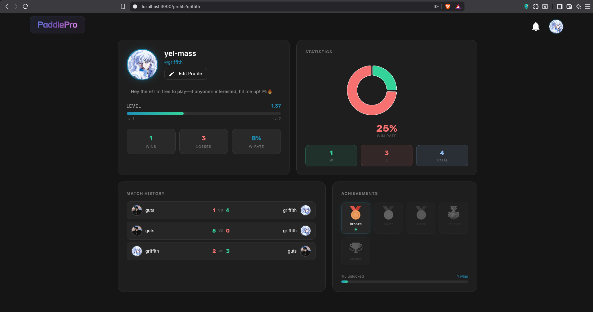
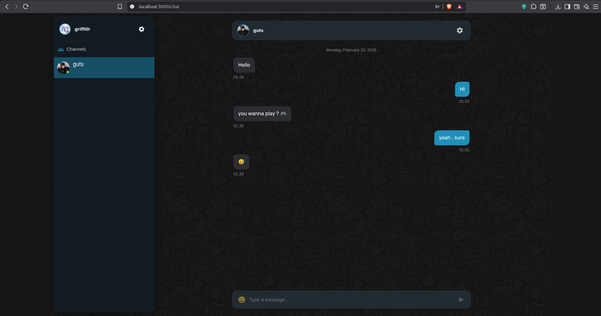
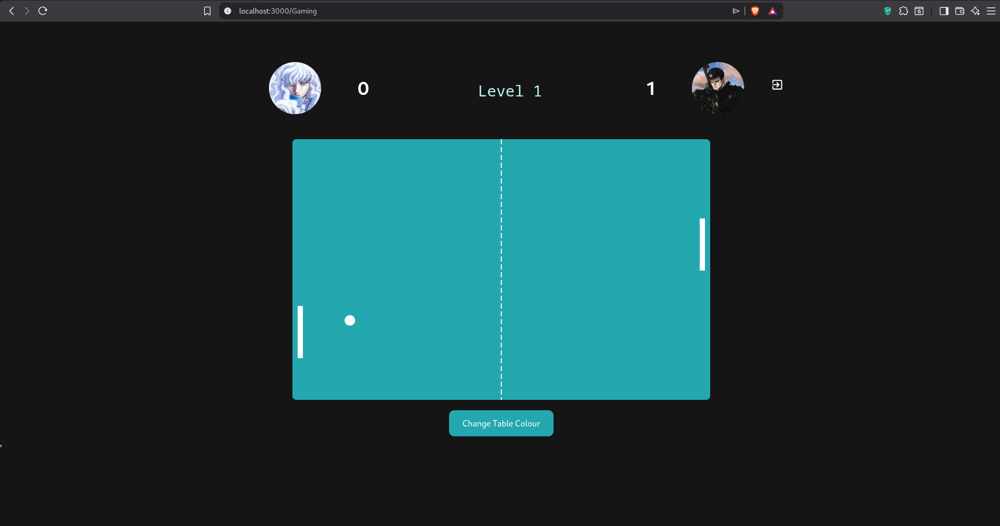

# 🏓 Transcendence - ft_transcendence

A full-stack multiplayer Pong game with real-time chat, user profiles, and social features. Built as part of the 42 School curriculum.



## 📋 Table of Contents

- [Features](#-features)
- [Tech Stack](#-tech-stack)
- [Screenshots](#-screenshots)
- [Architecture](#-architecture)
- [Getting Started](#-getting-started)
- [Environment Variables](#-environment-variables)
- [Database Schema](#-database-schema)
- [API Endpoints](#-api-endpoints)
- [Contributing](#-contributing)

## ✨ Features

### 🎮 Game
- Real-time multiplayer Pong game
- Matchmaking system
- Game history and statistics
- Live score tracking

### 💬 Chat
- Real-time direct messaging
- Group channels (Public, Private, Protected)
- Channel administration (admins, mute, ban, kick)
- Emoji support
- Block users functionality

### 👤 User Management
- OAuth authentication (42 Intra & Google)
- Two-Factor Authentication (2FA)
- Customizable user profiles
- Friend system with requests
- Online status tracking
- User levels and achievements

### 🔔 Notifications
- Real-time notifications
- Friend requests alerts
- Game invitations
- Channel invites

## 🛠 Tech Stack

### Frontend
- **React 18** - UI Library
- **TypeScript** - Type Safety
- **Vite** - Build Tool
- **TailwindCSS** - Styling
- **Material UI** - Component Library
- **Socket.io Client** - Real-time Communication
- **React Router** - Navigation
- **Axios** - HTTP Client

### Backend
- **NestJS 10** - Node.js Framework
- **TypeScript** - Type Safety
- **Prisma** - ORM
- **PostgreSQL 16** - Database
- **Socket.io** - WebSocket Communication
- **Passport.js** - Authentication
- **JWT** - Token Management
- **Speakeasy** - 2FA

### DevOps
- **Docker** - Containerization
- **Docker Compose** - Orchestration
- **Nginx** - Reverse Proxy

## 📸 Screenshots

### Login Page
Secure authentication with 42 Intra and Google OAuth options.


### Home Page
Dashboard with quick access to all features, online friends, and recent activities.



### Profile Page
View user statistics, game history, achievements, and manage account settings.



### Chat Page
Real-time messaging with direct messages and group channels.



### Game Page
Classic Pong gameplay with real-time multiplayer support.



## 🏗 Architecture

```
┌─────────────────────────────────────────────────────────────────┐
│                         NGINX (Port 80)                         │
│                      Reverse Proxy & Static                     │
└─────────────────────────────────────────────────────────────────┘
                                  │
                 ┌────────────────┴────────────────┐
                 │                                 │
                 ▼                                 ▼
┌─────────────────────────────┐   ┌─────────────────────────────┐
│        Frontend             │   │         Backend             │
│     React + Vite + TS       │   │     NestJS + Prisma         │
│      (Static Files)         │   │       (Port 4000)           │
└─────────────────────────────┘   └─────────────────────────────┘
                                                 │
                                                 ▼
                                  ┌─────────────────────────────┐
                                  │        PostgreSQL           │
                                  │        (Port 5432)          │
                                  └─────────────────────────────┘
```

### Docker Services

| Service    | Image                | Description                    |
|------------|----------------------|--------------------------------|
| `db`       | postgres:16-alpine   | PostgreSQL Database            |
| `backend`  | Custom NestJS        | API Server                     |
| `frontend` | Custom React/Nginx   | Static Frontend                |
| `nginx`    | nginx:1.27-alpine    | Reverse Proxy                  |

## 🚀 Getting Started

### Prerequisites

- Docker & Docker Compose
- Node.js 18+ (for local development)
- Git

### Quick Start

1. **Clone the repository**
   ```bash
   git clone https://github.com/elyassir/ping-pong.git
   cd ping-pong
   ```

2. **Set up environment variables**
   ```bash
   cp example.env .env
   cp api/example.env api/.env
   cp client/env.example client/.env
   ```

3. **Configure your environment variables** (see [Environment Variables](#-environment-variables))

4. **Start the application**
   ```bash
   docker-compose up --build
   ```

5. **Access the application**
   - Frontend: http://localhost
   - API: http://localhost/api

### Local Development

#### Backend
```bash
cd api
npm install
npx prisma generate
npx prisma migrate dev
npm run start:dev
```

#### Frontend
```bash
cd client
npm install
npm run dev
```

## 🔐 Environment Variables

### Root `.env`
```env
POSTGRES_USER=your_db_user
POSTGRES_PASSWORD=your_db_password
POSTGRES_DB=transcendence
```

### API `.env`
```env
DATABASE_URL=postgresql://user:password@db:5432/transcendence
JWT_SECRET=your_jwt_secret

# 42 OAuth
FORTYTWO_CLIENT_ID=your_42_client_id
FORTYTWO_CLIENT_SECRET=your_42_client_secret
FORTYTWO_CALLBACK_URL=http://localhost/api/auth/42/callback

# Google OAuth
GOOGLE_CLIENT_ID=your_google_client_id
GOOGLE_CLIENT_SECRET=your_google_client_secret
GOOGLE_CALLBACK_URL=http://localhost/api/auth/google/callback
```

### Client `.env`
```env
VITE_API_URL=http://localhost/api
VITE_WS_URL=http://localhost
```

## 📊 Database Schema

### Main Models

- **User** - User accounts with profiles, stats, and 2FA
- **Friendship** - Friend relationships and requests
- **Game** - Game sessions and scores
- **Group** - Chat channels with roles
- **GroupMessages** - Channel messages
- **Direct** - Direct message conversations
- **UserMessage** - Direct messages
- **Notifications** - User notifications
- **Blocked** - Blocked users

## 📡 API Endpoints

### Authentication
| Method | Endpoint               | Description           |
|--------|------------------------|-----------------------|
| GET    | `/auth/42`             | 42 OAuth Login        |
| GET    | `/auth/google`         | Google OAuth Login    |
| GET    | `/auth/42/callback`    | 42 OAuth Callback     |
| GET    | `/auth/google/callback`| Google OAuth Callback |

### Users
| Method | Endpoint               | Description           |
|--------|------------------------|-----------------------|
| GET    | `/users`               | Get all users         |
| GET    | `/users/:id`           | Get user by ID        |
| PATCH  | `/users/:id`           | Update user           |

### Friends
| Method | Endpoint               | Description           |
|--------|------------------------|-----------------------|
| GET    | `/friends`             | Get friends list      |
| POST   | `/friends/request`     | Send friend request   |
| POST   | `/friends/accept`      | Accept friend request |

### Chat
| Method | Endpoint               | Description           |
|--------|------------------------|-----------------------|
| GET    | `/groups`              | Get all groups        |
| POST   | `/groups`              | Create a group        |
| GET    | `/messages`            | Get messages          |
| POST   | `/messages`            | Send a message        |

### Game
| Method | Endpoint               | Description           |
|--------|------------------------|-----------------------|
| GET    | `/game/history`        | Get game history      |
| GET    | `/game/stats`          | Get user game stats   |

### 2FA
| Method | Endpoint               | Description           |
|--------|------------------------|-----------------------|
| POST   | `/tfa/generate`        | Generate 2FA secret   |
| POST   | `/tfa/verify`          | Verify 2FA code       |
| POST   | `/tfa/enable`          | Enable 2FA            |
| POST   | `/tfa/disable`         | Disable 2FA           |


## 📄 License

This project is part of the 42 School curriculum.

---

<p align="center">Made with ❤️ at 42</p>
